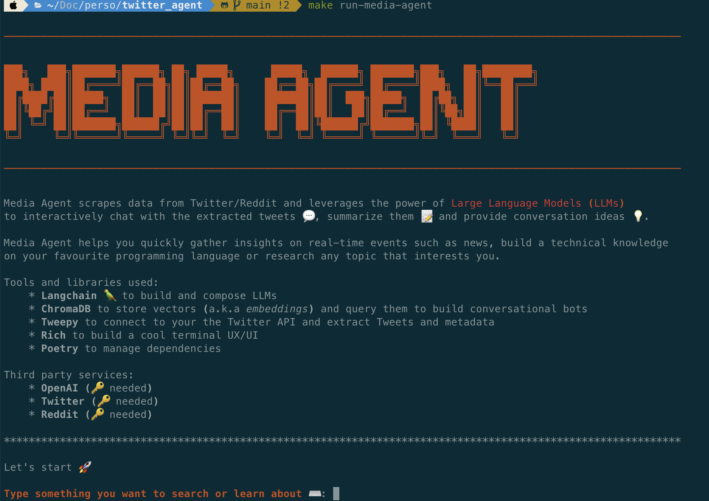

# Media Agent

Media Agent scrapes Twitter and Reddit, summarizes what it finds with an LLM, and lets you chat with the results in an interactive terminal.

<p align="center">
  
</p>

<p align="center">
  <a href="https://www.loom.com/share/f4954e7d34ef4b7b8491e2bf910e8521">▶ Watch the demo</a>
</p>

## What it does

- Scrapes tweets or Reddit submissions on your behalf, either from a list of accounts/subreddits or a list of keywords
- Embeds the scraped content with OpenAI embeddings
- Indexes the embeddings in a local ChromaDB vector store
- Generates a short summary of the results plus three follow-up questions
- Opens an interactive chat session grounded in the scraped content, with sources
- Saves each conversation (with metadata) to `outputs/history.json`
- Rich terminal UI and logging

## Tech stack

| Purpose               | Library         |
|------------------------|-----------------|
| LLM orchestration       | [LangChain](https://python.langchain.com/) |
| Vector store             | [ChromaDB](https://www.trychroma.com/) |
| Twitter API client       | [Tweepy](https://www.tweepy.org/) |
| Reddit API client         | [PRAW](https://praw.readthedocs.io/) |
| Terminal UI                | [Rich](https://github.com/Textualize/rich) |
| Dependency management | [Poetry](https://python-poetry.org/) |

## Requirements

- **Python 3.9, 3.10, or 3.11** (this project pins older versions of LangChain/ChromaDB/OpenAI that are not compatible with Python 3.12+)
- [Poetry](https://python-poetry.org/docs/#installation)
- API keys for OpenAI, Twitter, and Reddit (see below) — only the keys for the platform(s) you actually want to scrape are required at runtime, but `OPENAI_API_KEY` is always needed

## Setup

1. **Clone the repo**

   ```bash
   git clone https://github.com/ishupandey0301/media-agent-.git
   cd media-agent-
   ```

2. **Install dependencies**

   ```bash
   poetry install --with dev
   ```

3. **Add your API credentials**

   Create a `.env` file at the root of the project:

   ```bash
   OPENAI_API_KEY=<your OpenAI API key>
   TWITTER_BEARER_TOKEN=<your Twitter bearer token>
   REDDIT_API_CLIENT_ID=<your Reddit client id>
   REDDIT_API_SECRET=<your Reddit client secret>
   REDDIT_USER_AGENT=<a descriptive user agent string, e.g. "media-agent by u/yourname">
   ```

   Where to get these:
   - OpenAI key: <https://platform.openai.com/api-keys>
   - Twitter bearer token: <https://developer.twitter.com/en/docs/apps/overview>
   - Reddit client id/secret: <https://www.geeksforgeeks.org/how-to-get-client_id-and-client_secret-for-python-reddit-api-registration/>

4. **Run the app**

   ```bash
   make run-media-agent
   ```

   This clears any previous local vector store (`db/`) and starts the interactive CLI. Follow the prompts to pick a platform (Twitter or Reddit), a topic/keywords or accounts, and how many posts to pull. Once the summary is generated you can ask follow-up questions, use the suggested `q1`/`q2`/`q3` shortcuts, or type `q` to quit.

   If you don't have `make` available, run the equivalent command directly:

   ```bash
   poetry run python -m src.main
   ```

## Troubleshooting

- **`ModuleNotFoundError` right after `poetry install`** — make sure you're on Python 3.9–3.11 (`python --version`); the pinned ChromaDB/LangChain versions don't install cleanly on 3.12+. Use `pyenv` or `poetry env use python3.11` to select a compatible interpreter.
- **Reddit `401`/`403` errors** — double check `REDDIT_USER_AGENT` is a unique, descriptive string; Reddit throttles generic ones.
- **Twitter errors** — this project uses API v2 with a bearer token only (app-level auth), so it can read public tweets but can't post or access user-specific endpoints.
- **Empty/garbled summary** — the model occasionally returns non-JSON output; if it happens repeatedly, try again or reduce `number_of_posts` so the prompt fits more comfortably in context.

## Roadmap

This is an ongoing project — contributions are welcome. Planned:

- More data sources: Substack, press, LinkedIn
- Support for open-source LLMs
- Support for Pinecone alongside ChromaDB
- Cloud deployment instructions
- Richer, more conversational prompts
- Actions to open a URL and pull in its content

## Star History

[](https://star-history.com/#ishupandey0301/media-agent-&Timeline)
